# Mars-Webscraping
Web scraping Mars information from websites.
 

Tyrone Fraley 
UC Berkley Extension 
August 31, 2022 

 

  

 
## Overview of the Project
In this project I automated Google Chrome to scrape and extract data from the National Aeronautics and Space Administration (NASA). To do this, I used python, pandas, beautiful soup, CSS, and splinter. My first action was to collect all articles from the NASA website. Later, I would collect Mars temp. data from https://data-class-mars-challenge.s3.amazonaws.com/Mars/index.html  and visualize this data within a jupyter notebook using matplotlib.

### Scraping Mars News

To gather my news data I first started by scraping the titles and preview text from https://redplanetscience.com/ . To visit the browser, in pandas I utilized the following functions: 

 

  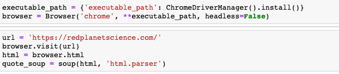

 
Once this proces was completed I began scraping information from the Mars News web page. To start off I used my html parser "quote_soup." By simply typing quote_soup and then pressing shift + enter I was able to see all of the HTML elements on the web page. To make the process quick and painless I clicked into the printed box of HTML information on my jupyter notebook, pressed command +F and searched for "title." 

 

  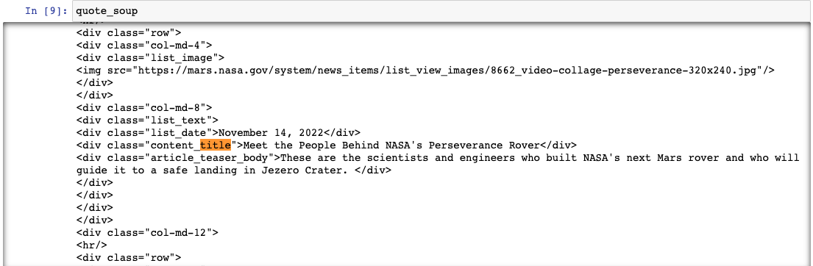

 
By searching for the titles of the news articles I was able to quickly go straight to my html tags. This is quicker, because if I had inspected the web page then I would have had to go through each html tags. In this case I knew I wanted to extract the titles and preview of the content. 
Next, I wanted to gather the titles and the summary text information. To do this I identified that titles and article_teaser_body were in div tags. To start off the basic concept of the functions needed to gather the necessary article information. I started off with quote_soup.find_all('div', class_=''). In this case, to get the titles I placed 'content_title' in the quotes after class_. This is a great start, however if I were to print this data, I would get the following: 
 

 

  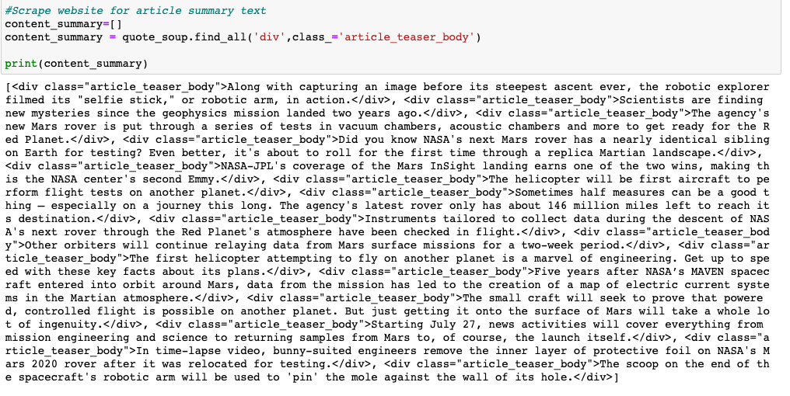

 
This doesn't work for the full analysis process to make everything nice and neat. So I had to remove the HTML tags. To do this I used the get_text function to make everything nice and neat. 
 

 

  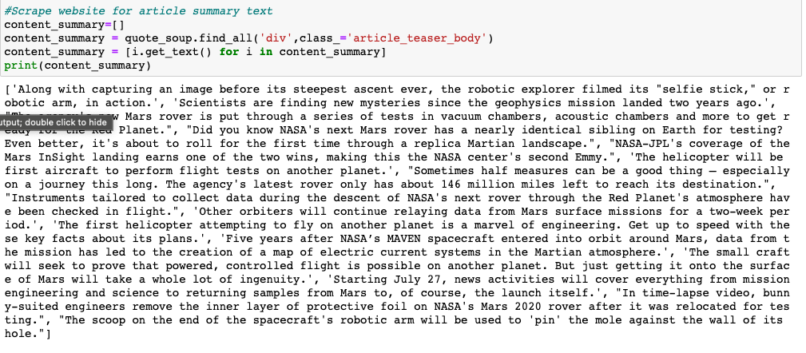

 
Now that I have my content summaries and my titles all in lists with their own name. I can create my dictionary. To create my mars_news dictionary I used a for loop to gather the lists. However, when printing this dictionary everything printed together almost like a paragraph. To switched from print() function to just simply typing mars_news without the print function and then hit command + enter.
 

 

  

 
Finally, at the end of the process. I now have all of my Mars news in a dictionary format. To complete this process I exported the data into MongoDB for safe keeping.
### Scraping Mars Temp Data
Similarly, to the Mars News information that was scraped. I scraped the previously mentioned website for Mars temperature data. To start off I visited the mars wepsite after setting up splinter. I then used the following fucntion to find the table classes: table = html_soup.find('table', class_='table'). At this point I could see all the HTML tags that I would begin to sift through and work with accordingly. 
The first thing I needed to do to be able to go scrape the data into a pandas data frame would be to get all of the table headers. This was completed by captureing the header through table_header = table.find_all('th'), because all headers were stored within the th tags. Using list comprehension and get_text() I was able to then convert table_header into a list that I called marslist1. When I printed this list I could see each header as a potential column (['id', 'terrestrial_date', 'sol', 'ls', 'month', 'min_temp', 'pressure']). Next, it was important to create a for loop to continue scraping the HTML table and extract data from each cell while adding data to the new data frame.  This was an interesting and challenging task. First, I had to define my dataframe with a list (df=[]). Then I created my for lopp to find all 'tr' tags, create a dictionary (mars_dict={}), assign columns from the 'td' tags, and assign the td tags to mars_data while stripping text in td (td.text.strip()). However, I was not done yet, because I needed to place an emphasis on the columns by using a try and except statement. I had a total of seven potential columns so I took mars_dict and assigned it for each column as follows: mars_dict[marslist1[0]] = mars_data[0]. Finally, after all seven columns were completely assigned to mars_dict I then appended mars_dict to df (df.append(mars_dict). 
 

 

  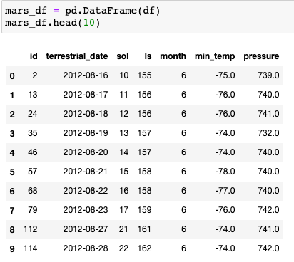

 
At this point in the analysis it was important for me to inspect my data frame. First, I wanted to change my column titles to make them a bit cleaner so I added capitol letters instead of leaving them all as lower case, because I am a bit OCD like that. I then converted the data type for the values in each column. 
To continue my research I wante dto first figure out how many Earth days ('Terrestrial_Date') exist. First I analysed the 'Sol' column which contains the number of martian days. Using the n.unique() function in my mars_df I was able to find that there were 1867 days in the data set. 
 

 

  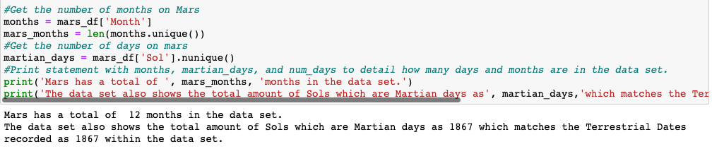

 
At this point in the study I was ready to start studying hte average temps by months on mars. However, I should note that this was done through a for loop. Using the range function at the beginning of my for loop I chose a range of 1-13 to itterate through. From this point I created a dictionary ("avg_monthly_temp") which would observe the "Mars_Month" and the "Temp_AVG" as keys/values in the dictionary. To get teh average temperature I used iloc[] for the month column to allow me to have a 12 month span and then I upgraded the function by adding the average minimum temp as well (avg_temp = mars_df.loc[mars_df['Month']== i]['Min_temp'].mean()). Next up was dropping any unnecessary values by rounding avg_temp, and adding the 12 months and the rounded average temp to my avg_monthly_temp dictionary. Finally I appended the avg_monthly_temp to a new variable called "temp_mars." Which was then converted into a data frame called "temp_mars_df." Now I could plot the data in a bar graph as follows:
 

 

  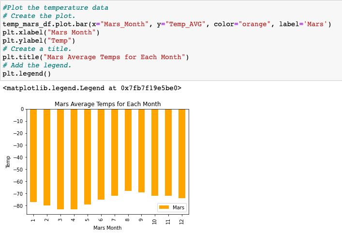

 
Moving forward with the analysis I wanted to figure out which months were hottest and coldest on Mars. To do this I looked at temp_mars_df["Temp_AVG"] and then added .max() for the hottest month and then .min() for the coldest month. I also was able to find the average temp by using .mean().
 

 

  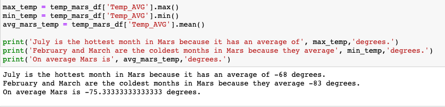

 
Now in the analysis I was tasked with figuring out the atmospheric pressure for mars. To do this I used a for loop just lik ethe one that I used for the temperature data. However, for this for loop I used "Pressure" as a value with my keys. After adding this data to a data frame I was able to plot the data in a bar graph. 
 

 

  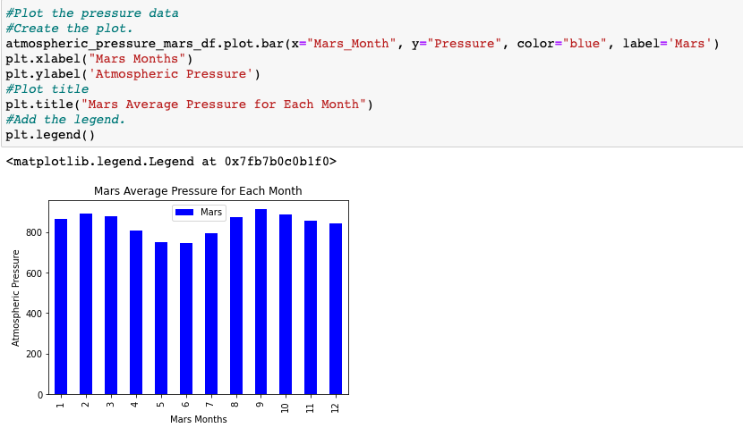

 
At this point I was getting close to the end of my analysis. However, I wanted to figure out how many days there were in a martian year. Which was approximately 686 terrestrial days. I would later use this data in my analysis, but for now, here is how that data was gathered. 
 

 

  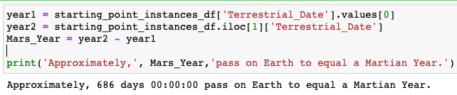

 
Finally, at the end of my study I looked at the minimum temp by day on Mars. I plotted it with "Sol" as my x values and "Min_temp" as my y values. This was a lot easier to do than the other graphs. However, this graph had to be plotted in a line graph for readability reasons. 
 

 

  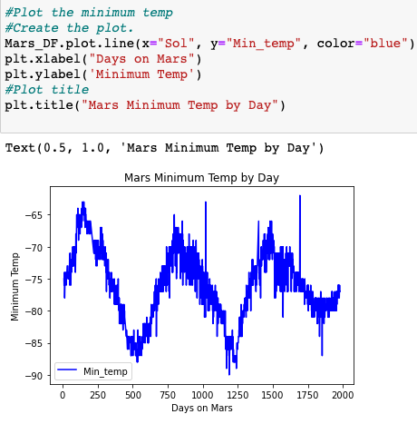

